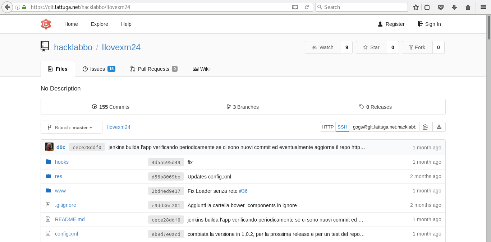

#Prendi il codice
##https://git.lattuga.net/hacklabbo/Ilovexm24

```
git clone gogs@git.lattuga.net:hacklabbo/Ilovexm24.git appXM24 
```




Su lattuga trovate anche il pdf e il markdown delle slide, da usare con Gitbook:


[https://git.lattuga.net:kiki/SlideApplicazioneXM24.git](https://git.lattuga.net:kiki/SlideApplicazioneXM24.git)


HacklabB0 2017 - licenza CC BY-NC-SA
