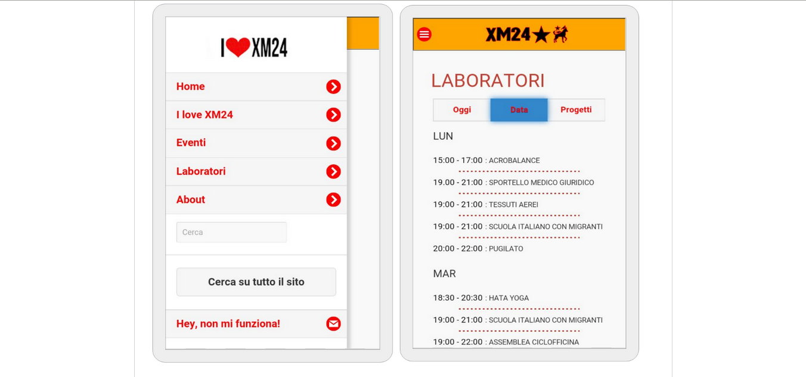

#Esempi di applicazioni ibride

* 
[https://app.sworkit.com/](https://app.sworkit.com/)

* 
[App theme ristorante](https://ionic-stage.herokuapp.com/stage/?app=restaurant)

* 
[Test di italiano per richiedenti asilo](http://www.edizionilalinea.it/testitaliano/)

* 
[Abc dei diritti](https://play.google.com/store/apps/details?id=it.redesignlab.ABCDEIDIRITTI&hl=it)

* 
[I love XM24]()

